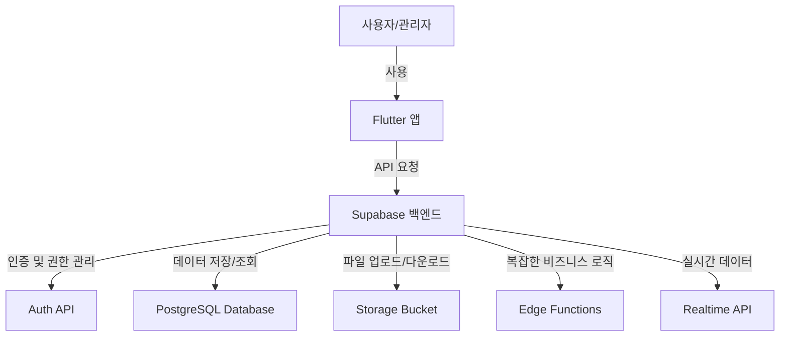

# 스튜디오 대관 서류 시스템 (Studio Rental Documentation System)

## 프로젝트 개요

스튜디오 대관 서류 시스템은 스튜디오 시설과 장비 대여를 위한 전자 서류 관리 솔루션입니다. 사용자는 시설 이용 동의서, 초상권 이용 동의서, 개인정보 처리 동의서 등 다양한 필수 서류를 전자적으로 작성하고 서명할 수 있으며, 장비 대여 요청 및 관리도 함께 수행할 수 있습니다.

이 시스템은 Flutter를 사용한 크로스 플랫폼 모바일/웹 애플리케이션과 Supabase 백엔드를 기반으로 구축되었습니다.

## 주요 기능

### 사용자 기능
- 전자 서류 작성 및 제출
- 디지털 서명 기능
- 장비 대여 요청 및 현황 확인
- 대여 가능 장비 목록 조회
- 개인 프로필 관리

### 관리자 기능
- 서류 승인/거부 및 관리
- 대여 요청 승인/거부 및 일정 관리
- 장비 관리 (등록, 수정, 삭제)
- 사용자 관리
- 통계 및 보고서 확인

## 기술 스택

### 프론트엔드
- **Flutter**: 크로스 플랫폼 UI 프레임워크
- **Provider**: 상태 관리 패턴
- **Supabase Flutter SDK**: 백엔드 연동

### 백엔드
- **Supabase**: BaaS(Backend as a Service) 플랫폼
  - **PostgreSQL**: 관계형 데이터베이스
  - **Auth**: 인증 및 사용자 관리
  - **Storage**: 파일 저장소
  - **Edge Functions**: 서버리스, 백엔드 기능
  - **Row Level Security**: 데이터 보안

## 시스템 아키텍처

시스템은 다음과 같은 주요 컴포넌트로 구성됩니다:



## 기술 문서

프로젝트의 기술 문서는 다음과 같이 구성되어 있습니다:

### 아키텍처 문서
1. [백엔드 로직 아키텍처](docs/1_backend_logic_architecture.md) - 백엔드 시스템의 전체 구조 및 설계 원칙
2. [상태 관리 구조도](docs/8_state_management.md) - 프론트엔드 상태 관리 패턴 및 구현 방법

### API 문서
3. [API 명세서](docs/2_api_specification.md) - API 엔드포인트 및 요청/응답 형식
4. [API 상세 문서](docs/3_api_documentation.md) - API 사용 방법 및 예제
5. [OpenAPI 명세서](docs/4_openapi_specification.md) - OpenAPI(Swagger) 형식의 API 명세

### 백엔드 기능 문서
6. [서버 핸들러 및 컨트롤러 함수](docs/5_server_handlers.md) - PostgreSQL 함수 및 트리거
7. [Edge Functions](docs/6_edge_functions.md) - 복잡한 비즈니스 로직을 처리하는 서버리스 함수

### 구현 및 통합 문서
8. [사용자 흐름](docs/7_user_flow.md) - 사용자 인터랙션 흐름 및 UI/UX 설계
9. [API 연동 문서](docs/9_api_integration.md) - 프론트엔드와 백엔드 API 통합 방법
10. [에러 처리 플로우](docs/10_error_handling_flow.md) - 에러 처리 전략 및 구현
11. [데이터베이스 스키마](docs/11_database_schema.md) - 데이터베이스 구조 및 관계

## 개발 환경 설정

### 요구 사항
- Flutter SDK (3.0 이상)
- Dart SDK (2.17 이상)
- Supabase 계정

### 설치 방법

1. 저장소 클론:
```bash
git clone https://github.com/your-username/studio-rental-system.git
cd studio-rental-system
```

2. 종속성 설치:
```bash
flutter pub get
```

3. 환경 변수 설정:
`assets/env.json` 파일을 생성하고 Supabase URL 및 Anon Key 설정:
```json
{
  "SUPABASE_URL": "your-supabase-url",
  "SUPABASE_ANON_KEY": "your-supabase-anon-key"
}
```

4. 실행:
```bash
flutter run
```

## 배포 가이드

### Flutter 앱 배포
- **Android**: `flutter build apk --release`
- **iOS**: `flutter build ios --release`
- **Web**: `flutter build web --release`

### Supabase 설정
1. Supabase 프로젝트 생성
2. DB 스키마 설정 및 마이그레이션 스크립트 실행
3. RLS 정책 구성
4. Edge Functions 배포

## 프로젝트 구조

```
.
├── assets/                # 애셋 파일
│   ├── env.json          # 환경 설정 파일
│   └── migrations/       # DB 마이그레이션 스크립트
├── docs/                 # 기술 문서
├── lib/
│   ├── constants/        # 앱 상수
│   ├── models/           # 데이터 모델
│   ├── providers/        # 상태 관리
│   ├── screens/          # UI 화면
│   ├── services/         # API 서비스
│   ├── utils/            # 유틸리티 함수
│   ├── widgets/          # 재사용 가능한 위젯
│   └── main.dart         # 앱 진입점
└── supabase/             # Supabase 설정 및 함수
```

## 라이센스

본 프로젝트는 MIT 라이센스 하에 배포됩니다. 자세한 내용은 [LICENSE](LICENSE) 파일을 참조하세요.

## 기여 방법

1. 이 저장소를 포크합니다.
2. 새 기능 브랜치를 생성합니다: `git checkout -b feature/amazing-feature`
3. 변경 사항을 커밋합니다: `git commit -m 'Add amazing feature'`
4. 브랜치를 푸시합니다: `git push origin feature/amazing-feature`
5. Pull Request를 생성합니다.

## 연락처

프로젝트 관리자: [이메일 주소] - [이름]